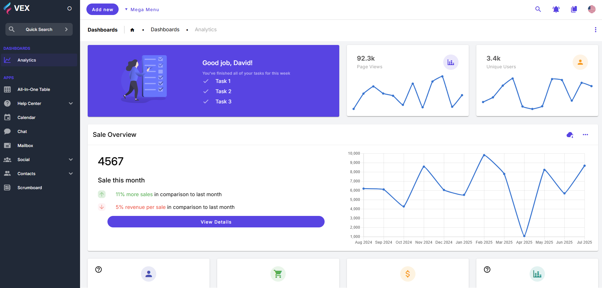
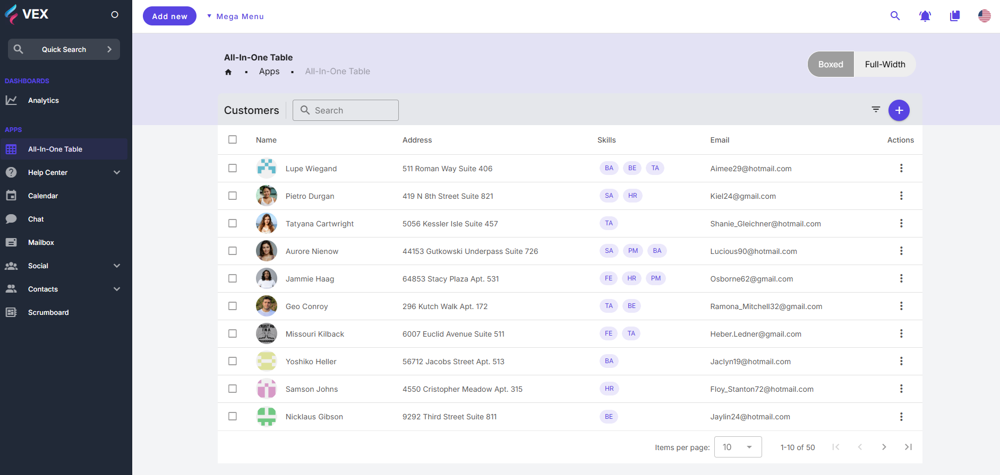
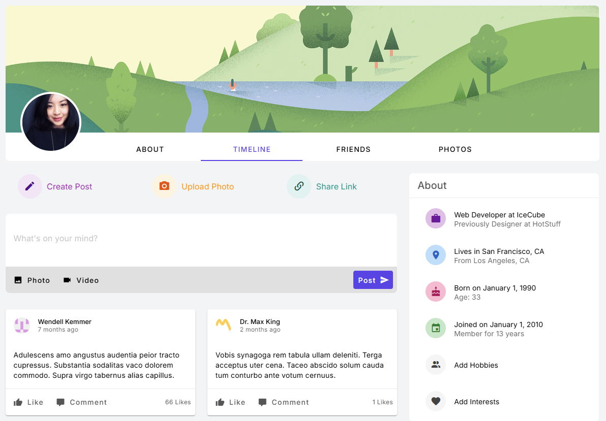
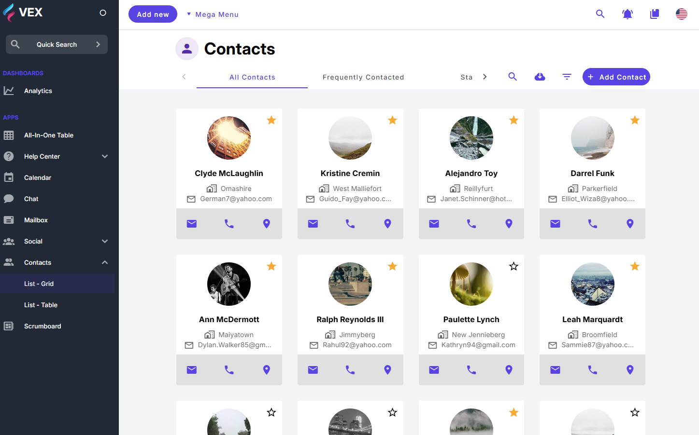
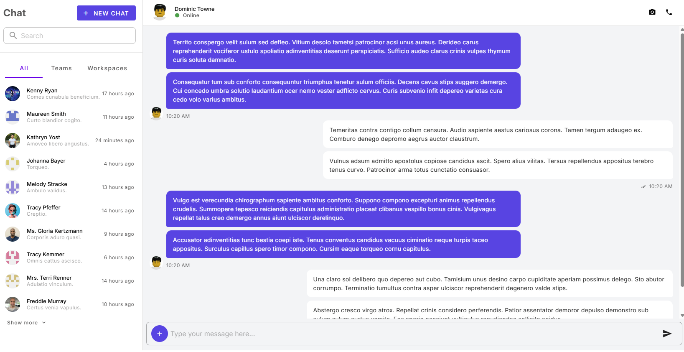
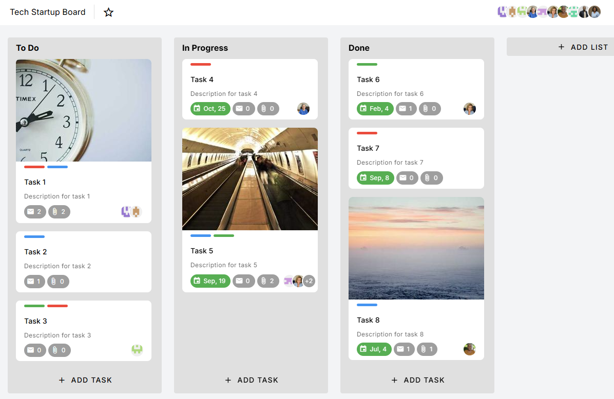

# Vex-Visurel Admin Dashboard

A modern, feature-rich admin dashboard built with **Nuxt 3**, **Vue 3**, **Vuetify**, and **TypeScript**. This project demonstrates advanced frontend development skills with a comprehensive business application interface.

## 🌟 Features

### 📊 **Analytics Dashboard**
- Interactive charts and data visualizations using Chart.js
- Statistical data representation with customizable themes

### 👥 **Account Management**
- Complete CRUD operations for user accounts
- Advanced data table with search, filtering, and pagination
- Form validation and responsive design
- Skills management system

### 📧 **Mail System**
- Full-featured mailbox with categories (Inbox, Sent, Drafts, Spam)
- Label system (Work, Personal, Important, Social)
- Email threading and content viewer
- Advanced search functionality

### 📋 **Kanban/Scrumboard**
- Drag-and-drop task management
- Task details with attachments, comments, and labels
- Team member assignment system

### 🗓️ **Calendar Integration**
- FullCalendar integration with event management
- Multiple view modes (month, week, day)
- Event creation and editing

### 💬 **Social Features**
- User profiles and timelines
- Photo galleries and friend suggestions
- Social interactions and posts

### 🎨 **Modern UI/UX**
- Material Design 3 principles
- Light/Dark theme support
- Responsive design for all devices
- Custom color schemes and typography

## 🛠️ Tech Stack

- **Framework**: Nuxt 3 (Latest)
- **Frontend**: Vue 3 with Composition API
- **UI Library**: Vuetify 3 with Material Design Icons
- **Language**: TypeScript
- **Styling**: SCSS + Vuetify theming system
- **Charts**: Chart.js for data visualization
- **Calendar**: FullCalendar Vue integration
- **Utilities**: VueUse for enhanced composition utilities
- **Mock Data**: Faker.js for realistic demo content

## 🚀 Getting Started

### Prerequisites
- Node.js 18+ or Bun runtime
- Git

### Installation

1. **Clone the repository**
```bash
git clone https://github.com/cuongdinhngo/vex-visurel.git
cd vex-visurel
```

2. **Install dependencies**
```bash
# Using Bun (recommended)
bun install

# Or using npm
npm install

# Or using pnpm
pnpm install

# Or using yarn
yarn install
```

3. **Start development server**
```bash
# Using Bun
bun run dev

# Or using npm
npm run dev

# Or using pnpm
pnpm dev

# Or using yarn
yarn dev
```

4. **Open your browser**
Navigate to `http://localhost:3000` to see the application.

## 📁 Project Structure

```
vex-visurel/
├── components/          # Reusable Vue components
│   ├── aio/            # Account management components
│   ├── charts/         # Data visualization components
│   ├── forms/          # Form-related components
│   ├── mailbox/        # Email system components
│   ├── scrumboard/     # Kanban board components
│   └── sections/       # Layout sections (AppBar, NavDrawer)
├── composables/        # Vue composition functions
│   ├── useAccounts.ts  # Account management logic
│   ├── useMails.ts     # Email system logic
│   ├── useScrumboard.ts # Kanban board logic
│   └── useStatistics.ts # Analytics data logic
├── pages/              # Application routes
├── layouts/            # Layout templates
├── assets/             # Static assets and styles
└── public/             # Public files
```

## 🎯 Key Features Demonstrated

### **Advanced Vue 3 Concepts**
- Composition API with TypeScript
- Reactive state management
- Custom composables for business logic
- Component composition patterns

### **Modern Development Practices**
- Type-safe development with TypeScript
- Modular architecture
- Responsive design principles
- Performance optimization

### **UI/UX Excellence**
- Material Design implementation
- Consistent design system
- Accessibility considerations
- Cross-browser compatibility

## 🔧 Build & Deployment

### Production Build
```bash
# Build for production
bun run build

# Preview production build
bun run preview
```

### Generate Static Site
```bash
bun run generate
```

## 🌐 Live Demo

[View Live Demo](https://cuongdinhngo.github.io/vex-visurel/)

## 📱 Screenshots

### 🏠 Dashboard Overview

*Main analytics dashboard with charts, statistics, and key performance indicators*

### 👥 Account Management

*Advanced data table with CRUD operations, search, and filtering capabilities*

### 📧 Mail System

*Complete email management with categories, labels, and content viewer*

### 👤 Social Profile

*User profile with social features, photo galleries, and friend suggestions*

### 📱 Contact Management

*Manage contacts with search, filtering, and categorization*

### 💬 Chat Interface

*Real-time chat interface with message history and user interactions*

### 📋 Kanban Board

*Drag-and-drop task management with team collaboration features*

### 🗓️ Calendar Integration

*FullCalendar integration with event management capabilities*

---

## 👨‍💻 Author

**Cuong Ngo**
- 🌐 Portfolio: [cuongdinhngo.github.io](https://cuongdinhngo.github.io/)
- 💼 GitHub: [@cuongdinhngo](https://github.com/cuongdinhngo)
- 📧 Email: dinhcuongngo@gmail.com
- 💬 LinkedIn: [Connect with me](https://www.linkedin.com/in/ngodinhcuong/)

---

**Built with ❤️ by [Cuong Dinh Ngo](https://github.com/cuongdinhngo)**
